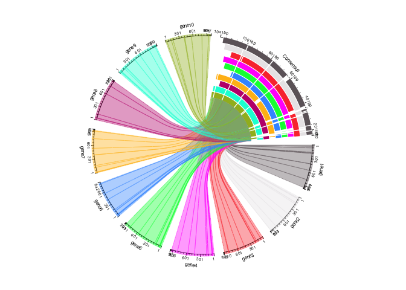
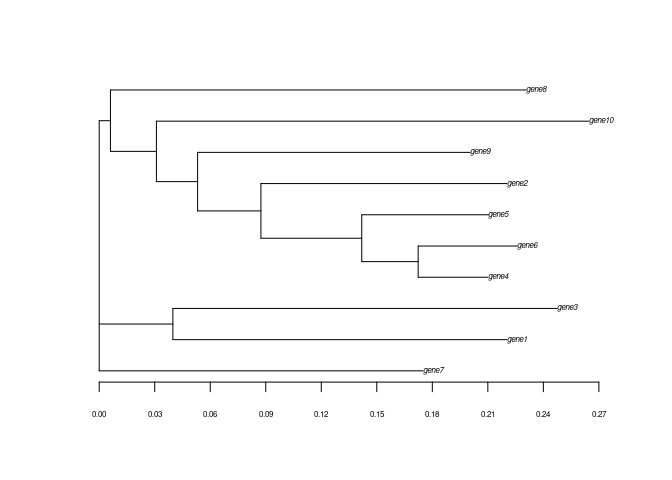
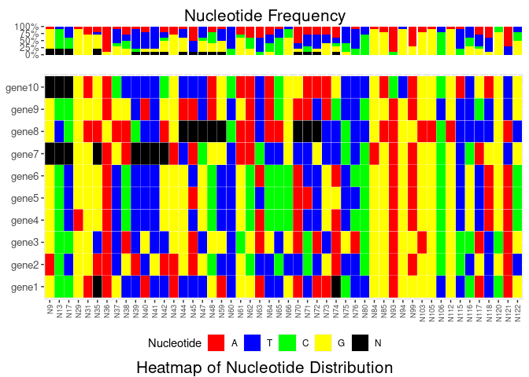
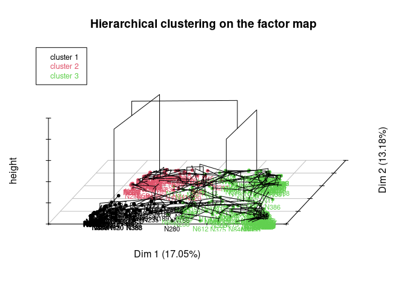

<!-- README.md is generated from README.Rmd. Please edit that file -->

# alignstatplot

The goal of alignstatplot is to provide a simple tool for performing
sequence alignment, descriptive analysis, and innovative visualization
of the generated results. alignstatplot provides some new analyses that
may aid researchers in identifying genic regions associated with gene
variability and can be combined with other analysis tools for studying
diversity. In this documentation, we will demonstrate how to use it and
how it can be combined with other well-known R packages.

## Installation

You can install the development version of alignstatplot like so:

``` r
library(devtools)
install_github("https://github.com/AlsammanAlsamman/alignstatplot")
```

## Clean and load

``` r
rm(list = ls())
library(alignstatplot)
library(ggplot2) #For saving Figures
```

## One function for all analyses

All the analyses can be performed using one function

``` r

SeqFile<-system.file("extdata","Example_Small.fasta",package = "alignstatplot")
AnnoFile<-system.file("extdata","Example_Small.anno",package = "alignstatplot")

MaxCluster = 4 #Numbe of SNP clusters   
MinimumClusterLength = 3 #Length of the SNP cluster to be considered
AlignMethod<- "ClustalW" #"ClustalW", "ClustalOmega", and "Muscle" 
OutFolder<-"output" #Output folder
Verbose<-T  
MaxMissPer=0.2    #Maximum missing allowed in sequence alignment
consZoomFactor <- 3 #Zooming factor for circle alignment visualization for the consensus compared to the sequences
cex.SeqLabels<-0.5 #Sequence labels font sizes

 # alignstatplot(SeqFile,
 #               AlignMethod,
 #               AnnoFile,
 #               OutFolder,
 #               MaxMissPer,
 #               MaxCluster,
 #               MinimumClusterLength,
 #               Verbose)
```

## Plot Sequence alignment using one function

Alignstatplot can be used to plot sequence alignment file. The function
can import sequence alignment in FASTA or clustalw

``` r

AlignFile<-system.file("extdata","Example_Sequences_Aligned.aln",package = "alignstatplot")
#AlignFile<-system.file("extdata","Example_Sequences_Aligned.fasta",package = "alignstatplot")

SeqFormat<-"clustalw" #clustalw or fasta   #input format
SeqFontSize<-0.5      # font label size
pdf("plot.pdf")
plotAlignCircle(AlignFile,SeqFormat = "clustalw",SeqFontSize = 0.5)
dev.off()
#> png 
#>   2
```

## More deep analysis

Example files can be used from the package.

``` r

SeqFile<-system.file("extdata","Example_Small.fasta",package = "alignstatplot")

#Simple Fasta File
#>Gene
#>ACTCGCTCGACTACGACCAT

AnnoFile<-system.file("extdata","Example_Small.anno",package = "alignstatplot")
#Annotation file, could contain any kind of information regarding gene structure
#It contains GeneName Region Start End direction forward or reverse
#gene1   intron      1   14      forward 
#gene1   exon    232     474     forward 

#Sequence alignment program to be used
AlignMethod<- "ClustalW" #"ClustalW", "ClustalOmega", and "Muscle" 

#Output Folder
OutFolder<-"output"
# Prepare environment
#dir.create(file.path("output"), showWarnings = FALSE)
```

# Sequence Alignment

Performing sequence alignment using the chosen tool.

``` r
#Align DNA sequences using clustalw
myClustalWAlignment <- seqAlign(SeqFile,AlignMethod)
#> use default substitution matrix

#extract sequence information
SeqInfo<-getSeqInfo(SeqFile)
#Convert sequence to list
SeqAligned<-alignment2Fasta(myClustalWAlignment,SeqInfo)
#Save aligned sequence in fasta format
alignment2Fasta(myClustalWAlignment,SeqInfo,paste(OutFolder,"Alignment.fasta",sep = "/"))
```

# Alignment statistics

Alignment statistics contains different aspects regarding sequence
alignment results.

``` r
StatsTable<-AlignmentStatsPerSeq(SeqInfo,SeqAligned)
#colnames(StatsTable)
 # [1] "SeqNo"           "Sequence.Name"   "Sequence.Length" "A"               "T"               "C"              
 # [7] "G"               "Gap"             "Gap.Percentage"  "GC"              "GC.Percentage"
head(StatsTable,5)
#>   SeqNo Sequence.Name Sequence.Length   A   T   C   G Gap Gap.Percentage  GC
#> 1     1         gene1             969 268 194 202 305  72          6.92% 507
#> 2     2         gene2             973 257 197 215 304  68          6.53% 519
#> 3     3         gene3             910 244 176 196 294 131         12.58% 490
#> 4     4         gene4             955 240 179 225 311  86          8.26% 536
#> 5     5         gene5             931 233 176 216 306 110         10.57% 522
#>   GC.Percentage
#> 1        52.32%
#> 2        53.34%
#> 3        53.85%
#> 4        56.13%
#> 5        56.07%
```

# Sequence Alignment plots

Plot Sequence alignment with consensus and links , Warining more than 20
genes it will not recognizable

``` r
#You can use drawConsWithNoGenes instead iof you have more than 20

#pdf(paste0(OutFolder,"/","SeqAlignmentCircleWithLinks.pdf"))
drawConsWithGenes(SeqInfo,SeqAligned)
```



``` r
#dev.off()
```

Plot Sequence alignment with consensus and No links

``` r

#pdf(paste0(OutFolder,"/","SeqAlignmentCircleWithNoLinks.pdf"),width = 15,height = 15)
drawConsWithNoGenes(SeqInfo,SeqAligned,cex.SeqLabels = 1)
```


``` r
#dev.off()
```

It can handle tenth of genes and still showing the alignment
differences.

``` r
knitr::include_graphics(paste0("Example_Out","/SeqAlignmentCircleWithNoLinks.png"))
```


\# Phylogenetic trees

## Statistics

``` r
  #Calculate Distance Table (Similarity distance)
  DistTable<-getDistanceMatrixTabel(SeqInfo,myClustalWAlignment)
  
  #Save Distance Table
  #write.table(DistTable,paste0(OutFolder,"/Distance_Table.tsv"),sep="\t")

  #Calculate Phylogenetic Tree
  myTree<-getTree(DistTable)
  
  #Save Phylogenetic Tree as Text to Folder
  #writeNexus(myTree,paste0(OutFolder,"/Tree.nexus"))

  #Save Tree Summary"))
  #sink(file=paste0(OutFolder,"/TreeSummary.txt"))
  summary(myTree)
#> 
#> Phylogenetic tree: myTree 
#> 
#>   Number of tips: 10 
#>   Number of nodes: 8 
#>   Branch lengths:
#>     mean: 0.0984519 
#>     variance: 0.00642544 
#>     distribution summary:
#>        Min.     1st Qu.      Median     3rd Qu.        Max. 
#> 0.006071412 0.034203569 0.054481207 0.174942542 0.233735569 
#>   No root edge.
#>   Tip labels: gene1 
#>               gene2
#>               gene3
#>               gene4
#>               gene5
#>               gene6
#>               gene7
#>               gene8
#>               gene9
#>               gene10
#>   No node labels.
  #sink()
```

## Draw Similarity distance matrix

``` r
# The similarity matrix as a heatmap
distanceHeatmap(DistTable,fontsizescale = 0.2)
```


## Phylogenetic tree simple plot

``` r
#The phylogenetic tree
plotTreeWithRuler(SeqInfo,myClustalWAlignment)
```



``` r
#The phylogenetic tree in combine with gene structure
plotTreeWithGenes(SeqInfo,myClustalWAlignment,AnnoFile)
```


``` r
#The phylogenetic tree in combine with simialrity matrix

plotSimilarityMatrixWithTree(SeqInfo,myClustalWAlignment)
```


    #> NULL

## PCA

The sequence alignment data are used for gene clustering using principle
component analysis

``` r
plotPCA(SeqInfo,myClustalWAlignment,ncluster = 4)
#> Warning: argument frame is deprecated; please use ellipse instead.
#> Warning: argument frame.type is deprecated; please use ellipse.type instead.
```


``` r
# ggsave(plot=p,paste0(OutFolder,"/","Genes_PCA.pdf"),device = "pdf",
#          width = 10, height = 8, dpi = 150, units = "in")
```

# Sequence alignment visualization plots

## Statistics of nucleotide variations

``` r

#Convert alignment To Table
SeqAlignedTable<-alignment2Table(SeqInfo,SeqAligned)

#Filter Table for missing and Mono 
SeqAlignedTableFiltered<-nucTableFilter(SeqAlignedTable,MaxMissPer = 0.2,removeMono = T)

#Calculate Frequency
NucCount<-nucFrequency(SeqAlignedTableFiltered)

NucCount[,1:5]
#>    N9 N13 N17 N29 N31
#> A 0.1 0.0 0.0 0.1 0.3
#> C 0.0 0.7 0.4 0.0 0.0
#> T 0.0 0.1 0.4 0.0 0.0
#> G 0.7 0.0 0.0 0.9 0.7
#> N 0.2 0.2 0.2 0.0 0.0
```

## plot sequence alignment statistics

### Frequency heatmap and chart

Heatmap and bar plots of the nucleotides frequency across the sequence
alignment

``` r
#plot sample
#nucTableHeatmap(SeqAlignedTableFiltered[,1:50],cex.SeqLabels = 5,cex.NucLabels = 5)

#Chart of the nucleotides frequency across the sequence alignment
#nucFrequencyPlot(NucCount[,1:50],F)

#combine heatmap and charts
#plot first 50 nucleotide variations
nucTableFreqHeatmap(SeqAlignedTableFiltered[,1:50])
```



``` r


#If the sequence is very long it can be split and saved to a folder

# dir.create(file.path(paste(OutFolder,"HeatMap_Freq",sep="/")), showWarnings = FALSE)
# # If The sequence was very long this can be used
# PlotList<-nucTableFreqHeatmapSplit(SeqAlignedTableFiltered,50)
# outPdfDir<-paste(OutFolder,"/","HeatMap_Freq","/",sep="")
# # #Save Plots
# saveSeqPlotList(PlotList,outPdfDir)
```

### Alignment nucleotide frequency logoplot

``` r
#The figure is big we can include in the documentation using this
knitr::include_graphics(paste0("Example_Out","/NucLogo.png"))
```


# Converting data to binary format

Binary format is very important step in several data analysis, where
most of the algorithms are not accepting allele-based format such
population structure analysis. There are several ways to convert
nucleotide formatted data (sequences) to binary.

## (A) Using Reference

Choosing reference is helping in searching for only variations that
differentiate between two cases (control/patient or
resistant/sensitive).

``` r
#One reference - based conversion
RefsNames<-c("gene1")
#Using One Reference
SeqBinaryTableOneRef<-seqTableToBinary(SeqAlignedTableFiltered,RefsNames,RemoveNonRefNuc = T)
SeqBinaryTableOneRef[1:5,1:5]
#>       N9 N13 N17 N29 N31
#> gene1  1   1   1   1   1
#> gene2  0   1   0   1   0
#> gene3  1   1   1   1   0
#> gene4  1   1   0   0   0
#> gene5  1   1   0   1   0
```

## (B) Using multiple references

In such cases, more than one reference can be used, with shared
nucleotide variations across reference genotypes used to create a shared
reference genotype that can be used to convert all data. This is a
stricter conversion in which only a few shared variations are used; this
can be used to search for specific interesting stable variations across
the control cases.

``` r
RefsNames<-c("gene1","gene2","gene3")
SeqBinaryTableMoreRef<-seqTableToBinary(SeqAlignedTableFiltered,RefsNames,RemoveNonRefNuc = T)
SeqBinaryTableMoreRef[1:5,1:5]
#>       N13 N29 N36 N60 N84
#> gene1   1   1   1   1   1
#> gene2   1   1   1   1   1
#> gene3   1   1   1   1   1
#> gene4   1   0   1   1   1
#> gene5   1   1   1   1   1
```

## (C) Using Non-reference conversion

The fisrt step will be to remove non-biallailic variations (tri-,
tetra-, ..) and assign 0 or 1 for alleles. This is the default way for
data conversion.

``` r
#report bialleles locations.
biallelicNuc<-getBiallelicByFreq(NucCount)
#Create a reference genotype.
GenotypeRef<-getRefGenotypeForbiallelic(NucCount,biallelicNuc)
#Convert data using this genotype as a reference
SeqBinaryTableByFreqRef<-seqTableToBinary(SeqAlignedTableFiltered,GenotypeRef,RemoveNonRefNuc = T,RefsNames = F)

SeqBinaryTableByFreqRef[1:5,1:5]
#>       N9 N13 N17 N29 N31
#> gene1  1   1   1   1   0
#> gene2  0   1   0   1   1
#> gene3  1   1   1   1   1
#> gene4  1   1   0   0   1
#> gene5  1   1   0   1   1
```

\#SNP Clustering Nucleotide variation clustering is a PCA-based analysis
that clusters SNP data across genes. It aids in identifying the
variation that occurs across genes, where some alleles tend to appear
together.

## clustering

``` r

#Allele Based Variations
Cluster<-SNPCluster(SeqAlignedTableFiltered)
```

## 3D Tree

Phylogenetic tree constructed showing the clustering association across
the loci (SNPs)

``` r

SNPClusterPlot3DTree(Cluster,60)
```

 \##
One Dimension Tree 2D phylogenetic tree

``` r
SNPClusterPlot1DTree(Cluster)
#> Warning: `guides(<scale> = FALSE)` is deprecated. Please use `guides(<scale> =
#> "none")` instead.
```

 \##
PCA Plot

``` r
SNPClusterPlotPCAMap(Cluster)
```

 \##
Drawing genes with cluster Map Draw the SNP location and assign the
cluster to the genes. The function takes a sequence, a sequence
alignment object, and the number of base pairs to consider as a cluster.
For example, if three nucleotides “ATC” belong to cluster 1 and the
cluster’s minimum bp is 4, it will not be drawn on gene. As a result,
the cluster should contain more than four base pairs close to each other
to be drawn, and it could be regarded as a motif segment across the
genes. SNP clustering could be used to look for consistent patterns that
are unaffected by differences in gene length.

``` r
SNPClusterPlot(SeqInfo,SeqAligned,Cluster,MaxCluster = 3,MinimumClusterLength = 3)
```


Add the phylogenetic tree to the plot.

``` r
# With phylogenetic tree
SNPClusterPlotWithTree(SeqInfo,myClustalWAlignment,Cluster,MaxCluster = 3, MinimumClusterLength = 3)
```


``` r


library(poppr)
#> Loading required package: adegenet
#> Loading required package: ade4
#> Registered S3 method overwritten by 'vegan':
#>   method     from      
#>   rev.hclust dendextend
#> 
#>    /// adegenet 2.1.7 is loaded ////////////
#> 
#>    > overview: '?adegenet'
#>    > tutorials/doc/questions: 'adegenetWeb()' 
#>    > bug reports/feature requests: adegenetIssues()
#> Registered S3 method overwritten by 'pegas':
#>   method      from
#>   print.amova ade4
#> This is poppr version 2.9.3. To get started, type package?poppr
#> OMP parallel support: available
SeqBinaryTableByFreqRef[1:10,1:10]
#>        N9 N13 N17 N29 N31 N35 N36 N37 N38 N39
#> gene1   1   1   1   1   0   -   0   1   0   1
#> gene2   0   1   0   1   1   1   0   0   0   0
#> gene3   1   1   1   1   1   0   0   0   1   1
#> gene4   1   1   0   0   1   0   0   0   0   1
#> gene5   1   1   0   1   1   0   0   0   0   1
#> gene6   1   1   0   1   1   0   0   0   0   1
#> gene7   -   -   -   1   1   -   0   1   1   -
#> gene8   1   0   1   1   0   1   0   0   1   0
#> gene9   1   1   1   1   1   0   0   1   0   1
#> gene10  -   -   -   1   0   0   0   0   0   1
length(SeqInfo$Name)
#> [1] 10
rownames(SeqBinaryTableByFreqRef)
#>  [1] "gene1"  "gene2"  "gene3"  "gene4"  "gene5"  "gene6"  "gene7"  "gene8" 
#>  [9] "gene9"  "gene10"
monpop <- df2genind(SeqBinaryTableByFreqRef,
                     ploidy = 1,
                     ind.names = SeqInfo$Name,
                     sep="")
 summary(monpop)
#> 
#> // Number of individuals: 10
#> // Group sizes: 10
#> // Number of alleles per locus: 3 3 3 2 2 3 1 2 2 3 2 3 3 2 3 3 3 3 2 1 2 2 2 2 1 2 3 2 2 2 3 1 1 1 1 1 1 2 2 1 2 2 1 2 2 2 2 2 2 2 2 2 1 2 2 1 2 2 2 2 1 2 2 1 1 2 1 2 1 1 2 2 2 2 2 1 2 2 2 3 2 2 2 2 2 3 2 1 2 2 2 2 2 1 3 2 1 2 2 2 2 3 2 3 3 2 2 2 1 2 1 1 2 2 2 2 1 2 2 2 2 2 2 1 2 1 1 2 1 2 1 2 1 2 2 1 2 1 2 1 1 1 2 2 1 2 2 2 2 1 2 2 2 1 2 2 2 1 2 2 2 1 2 2 2 1 2 1 2 1 2 2 1 2 2 2 1 1 2 2 2 2 1 2 2 3 3 2 2 3 3 2 2 3 2 3 2 3 2 3 3 3 2 3 2 2 2 1 1 1 2 1 2 2 1 2 2 1 1 2 1 1 2 2 2 1 2 2 1 1
#> // Number of alleles per group: 428
#> // Percentage of missing data: 0 %
#> // Observed heterozygosity: 0
#knitr::knit_exit()
```
